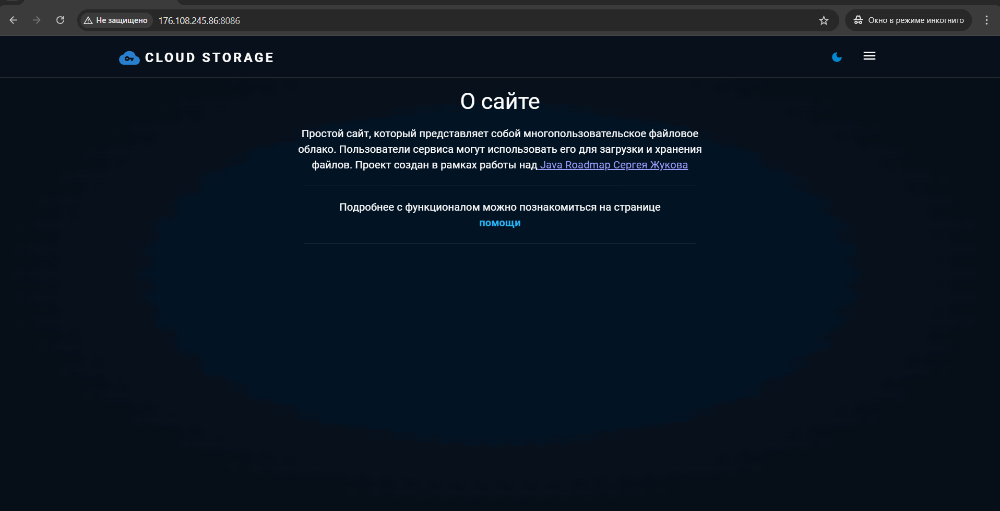

# File-storage
> Многопользовательское файловое облако. Пользователи сервиса могут использовать его для загрузки и хранения файлов. Источником вдохновения для проекта является Google Drive.


### Функционал приложения
Проект представляет из себя монолитное приложение, предоставляющее функционал по REST API. 
Проект выполнялся в рамках [роадмапа Сергея Жукова](https://zhukovsd.github.io/java-backend-learning-course/projects/cloud-file-storage/).

### Работа с пользователями:
* Регистрация
* Авторизация
* Logout

### Работа с файлами и папками:
* Загрузка (upload) файлов и папок
* Создание новой пустой папки (аналогично созданию новой папки в проводнике)
* Удаление
* Переименование и перемещение
* Скачивание файлов и папок

### Интерфейс приложения


### Запуск приложения
> Предварительно установить:
> * [Docker desktop](https://www.docker.com/products/docker-desktop/) для поднятия окружения. 
> * [Git](https://git-scm.com/) для клонирования репозитория.
> * [Java Runtime Environment (JRE) или JDK 21+](https://adoptium.net/temurin/releases/) — для запуска Spring Boot jar, если планируете запускать проект локально.

### 1. Склонируйте репозиторий
```bash
    git clone https://github.com/floMaxter/file-storage.git
```
or download [zip-archive](https://github.com/floMaxter/file-storage/archive/refs/heads/main.zip)

### 2. Перейдите в корневую директорию
```bash
cd file-storage
```

### 3. Запустите приложение
* Если хотите запустить всё приложение (frontend + backend + окружение) в docker:
```bash
docker-compose -f docker-compose.local-docker.yml --env-file env.local-docker up -d
```
* Если хотите запустить только окружение и фронт, выполните:
```bash
docker-compose -f docker-compose.dev.yml --env-file env.dev up -d
```
* А затем запустите backend локально:
```bash
./gradlew clean build -x test
java -jar build/libs/file-storage-0.0.1-SNAPSHOT.jar
```

### 4. Использование приложения
* После запуска приложения документация Swagger UI будет доступна по адресу:

> **[http://localhost:8085/swagger-ui/index.html](http://localhost:8080/swagger-ui/index.html)**

* А Frontend по адресу:

> **[http://localhost:8086](http://localhost:8086)**